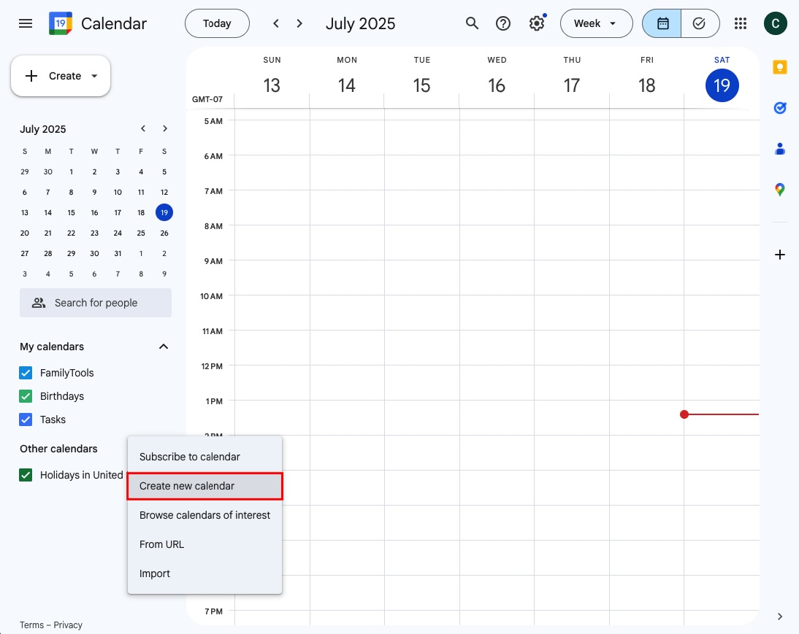
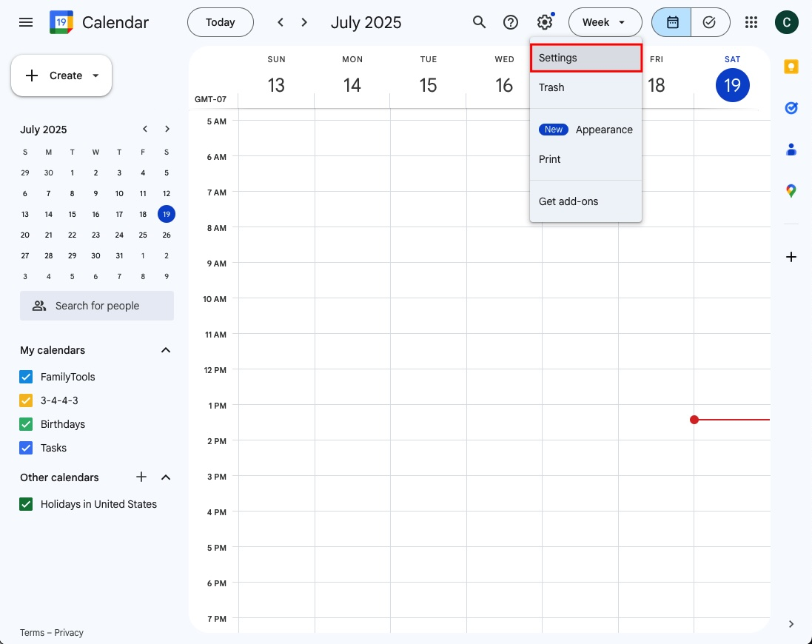
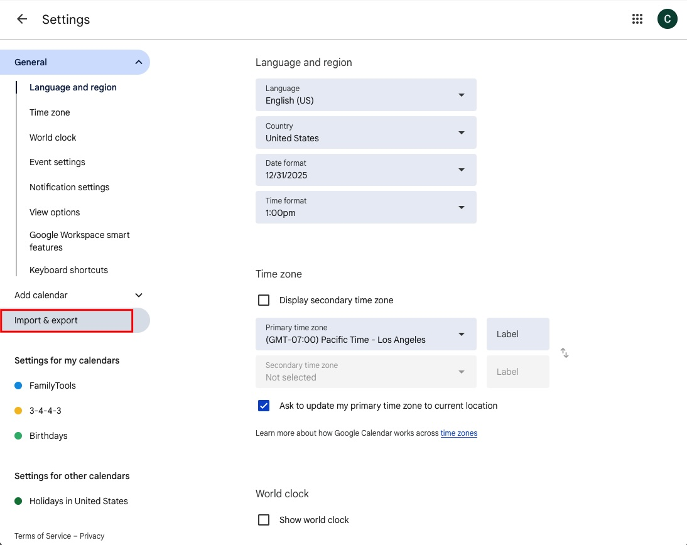
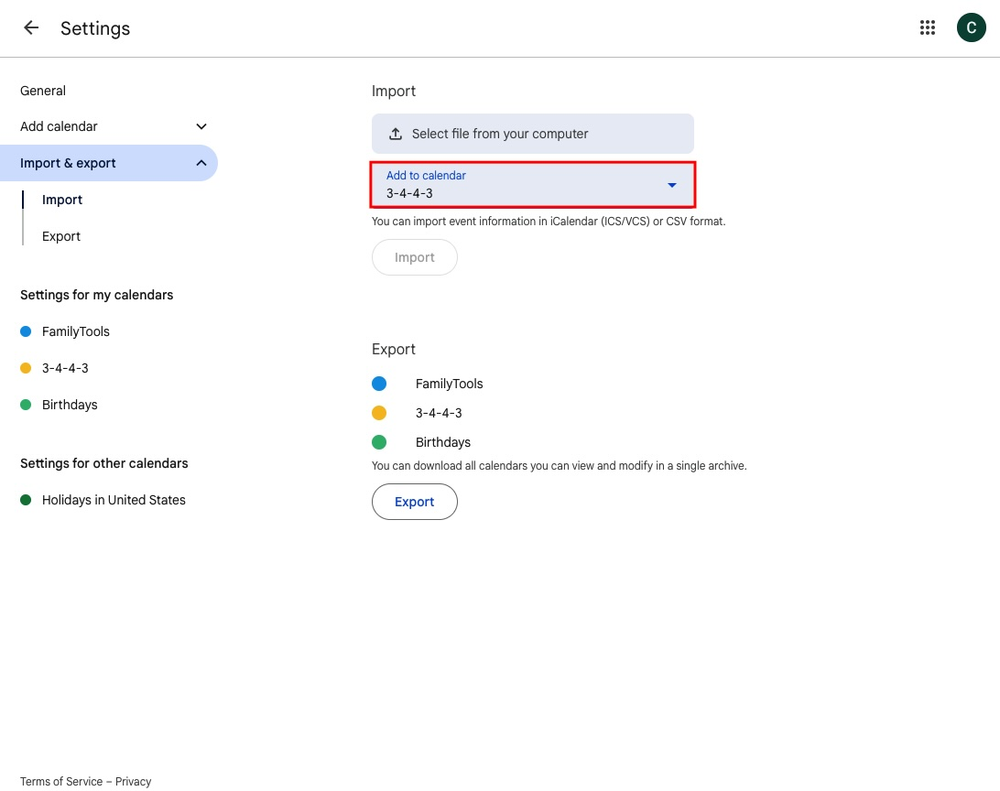

# Import ICS Into Google Calendar

## Step 1: Create a new calendar

It's important to use a new calendar so it can easily be deleted and recreated, if necessary. If you were to import the ICS file into an existing calendar and you wanted to delete it, then you would need to delete the events one-by-one.

Performing step 1:

1. On the left side of Google Calendar, look for "Other calendars +"
2. Click on the plus symbol and select "Create new calendar"
3. Name the calendar and click "Create calendar"
4. Click the back arrow to return to the main Google calendar page

## Step 2: Open the setting panel

Performing step 2:
1. Click on the gear symbol and select "Settings"

## Step 3: Click "Import & Export"

Performing step 3:
1. On the left panel of the settings screen, click "Import & Export"

## Step 4: Importing the file

> [!WARNING]  
> It's important that you select the new calendar created in step 1

Performing step 4:
1. Select the new calendar, created in step 1, from the pull down
2. Click the "Select file from your computer" button and select the ICS file
3. Click the import button
4. Wait for a pop-up to say the calendar events have been imported. This can take some time.
5. Click the back array to return to the main Google calendar window

