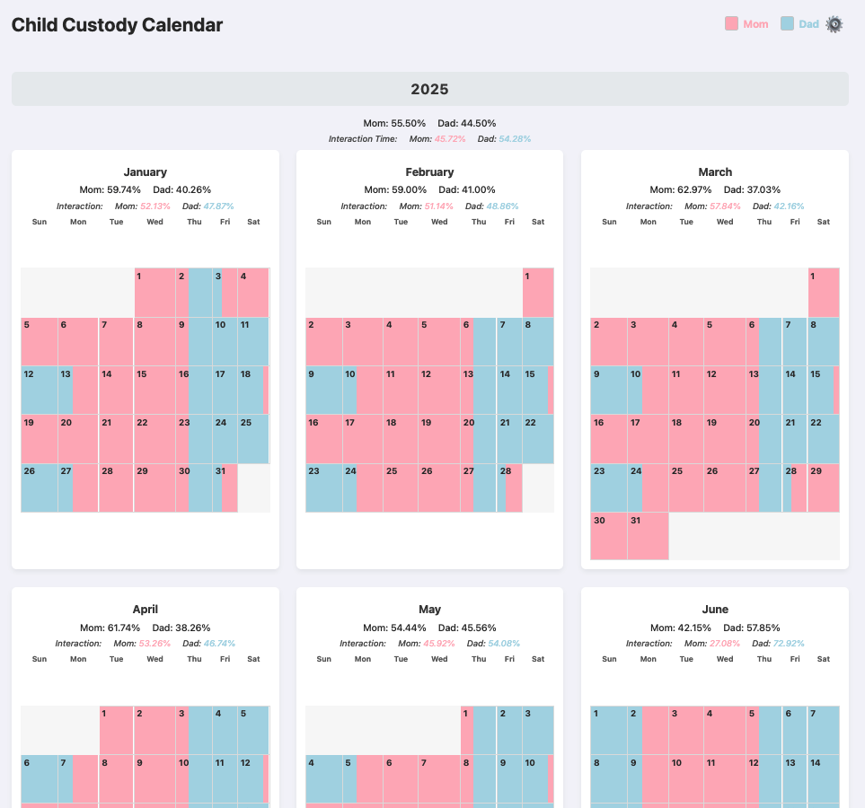
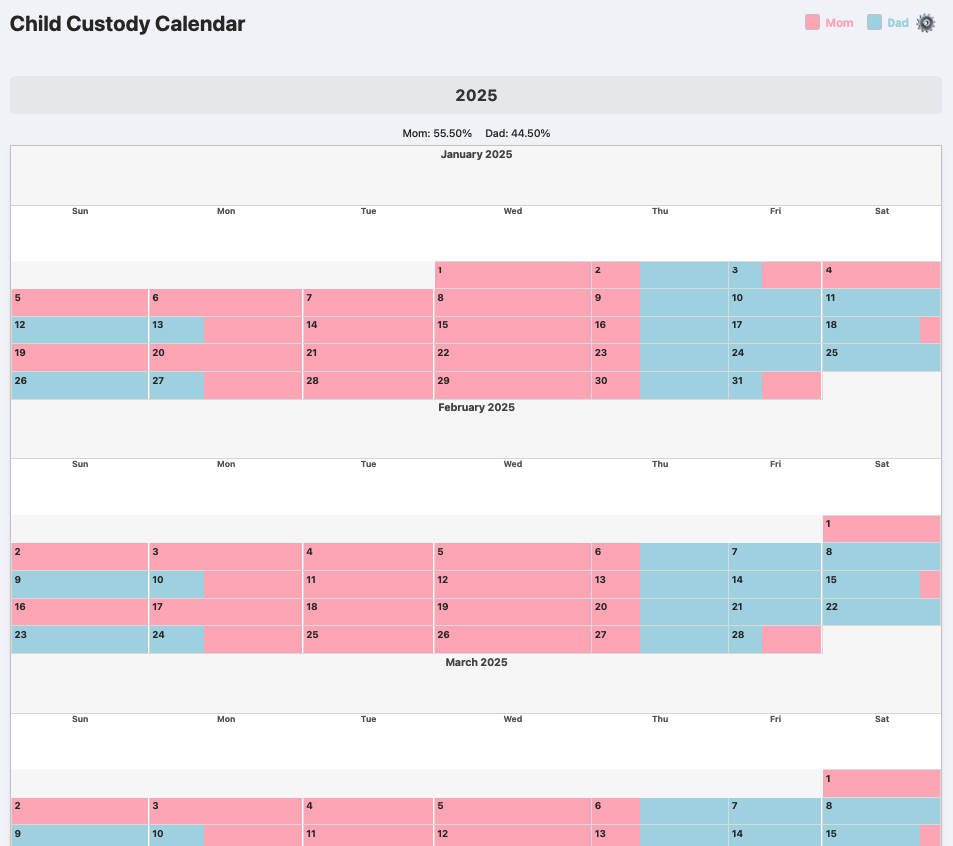

# Custody Calendar Generator




This Python application generates a detailed, interactive HTML calendar to visualize complex child custody schedules. It is designed to handle different schedules for school terms and summer holidays, calculate time percentages with fine-grained control, and provide detailed, auditable reports.

The output is a self-contained web page that can be viewed in any modern browser, with no internet connection required.

## Features

  * **Dynamic Date Range:** Set the start and end years for the calendar in a configuration file.
  * **Dual Schedule System:** Define separate custody schedules (e.g., "School" and "Summer") and map them to specific weeks of the year.
  * **Dynamic Cycle Lengths:** The program automatically determines the length of a schedule's repeating cycle (e.g., 2-week, 4-week) from the schedule files.
  * **File-Based Configuration:** All schedules, date ranges, and analysis windows are configured using simple CSV and JSON files, requiring no changes to the Python code.
  * **Visual HTML Calendar:** Generates a clean calendar with color-coded custody bars for "Mom" and "Dad" for at-a-glance understanding.
  * **Percentage Calculation:** Automatically calculates and displays the total custody percentage for each parent, broken down by year and by month.
  * **Interaction Time Analysis:** Define specific time windows (e.g., after school) in separate JSON files for school and summer periods to see custody percentages calculated *only* for that time.
  * **Interactive UI:**
      * **Continuous View:** Toggle between a standard grid layout and a seamless, vertically stacked view of the entire year.
      * **Modal Viewer:** Click on any month in the grid view for an enlarged display.
      * **Settings Panel:** A clean popup panel provides access to the view toggle and export options.
  * **Auditable Exports:**
      * **Export Page:** Use the browser's print function to create a clean, color-coded PDF of the calendar.
      * **Export Calculations:** Generate a detailed CSV report showing the month-by-month breakdown of time slots and percentage calculations for easy auditing.

-----

## How to Use

### 1\. Prerequisites

  * You must have **Python 3** installed on your system.

### 2\. Setup

1.  Create a new folder for your project.
2.  Save the main Python script as `create_calendar.py` inside this folder.
3.  In the **same folder**, create the following configuration files. The program reads its entire configuration from these files.

### 3\. Configuration Files

#### **`schedule_map.json` (Required)**

This is the main control file. It defines the date range for the calendar and maps which weeks of the year (using standard ISO week numbers) use which schedule.

```json
{
  "start_year": 2025,
  "end_year": 2028,
  "school_weeks": [1, 2, 3, 4, 5, 6, 7, 8, 9, 10, 11, 12, 13, 14, 15, 16, 17, 18, 19, 20, 21, 22, 36, 37, 38, 39, 40, 41, 42, 43, 44, 45, 46, 47, 48, 49, 50, 51, 52],
  "summer_weeks": [23, 24, 25, 26, 27, 28, 29, 30, 31, 32, 33, 34, 35]
}
```

-----

#### **`school_schedule.csv` & `summer_schedule.csv` (Required)**

These files define the repeating custody patterns. The program automatically detects the cycle length (e.g., a 2-week or 4-week cycle) based on the highest number in the `Week of Cycle` column.

The files must contain these exact columns:
`Custodian,Week of Cycle,Window number,Start Day of Window,Start Time of Window,End Day of Window,End Time of Window`

**Example `summer_schedule.csv` (a 2-week repeating cycle):**

```csv
Custodian,Week of Cycle,Window number,Start Day of Window,Start Time of Window,End Day of Window,End Time of Window
Mom,1,1,Sunday,00:00,Sunday,24:00
Dad,2,1,Sunday,00:00,Sunday,24:00
```

-----

#### **`school_interaction.json` & `summer_interaction.json` (Optional)**

These optional files define the time windows for the "Interaction Time" analysis. If a file is not present, the analysis for that schedule type will be skipped.

**Example `school_interaction.json`:**

```json
{
  "monday": { "start": "17:00", "end": "20:00" },
  "tuesday": { "start": "17:00", "end": "20:00" },
  "wednesday": { "start": "17:00", "end": "20:00" },
  "thursday": { "start": "17:00", "end": "20:00" }
}
```

### 4\. Running the Program

Once all your configuration files are set up, run the script from your terminal:

```sh
python create_calendar.py
```

-----

### 5\. Viewing the Output

The script will generate two files:

  * `custody_calendar.html`: The main calendar file.
  * `style.css`: The stylesheet.

Simply open **`custody_calendar.html`** in your web browser (e.g., Chrome, Firefox, Safari) to view and interact with your schedule. Use the **Settings** button (⚙️) to toggle views or export your data.

### 6\. Customization

To change the calendar's appearance (colors, fonts, spacing), you can directly edit the `style.css` file and refresh the page in your browser to see the changes.