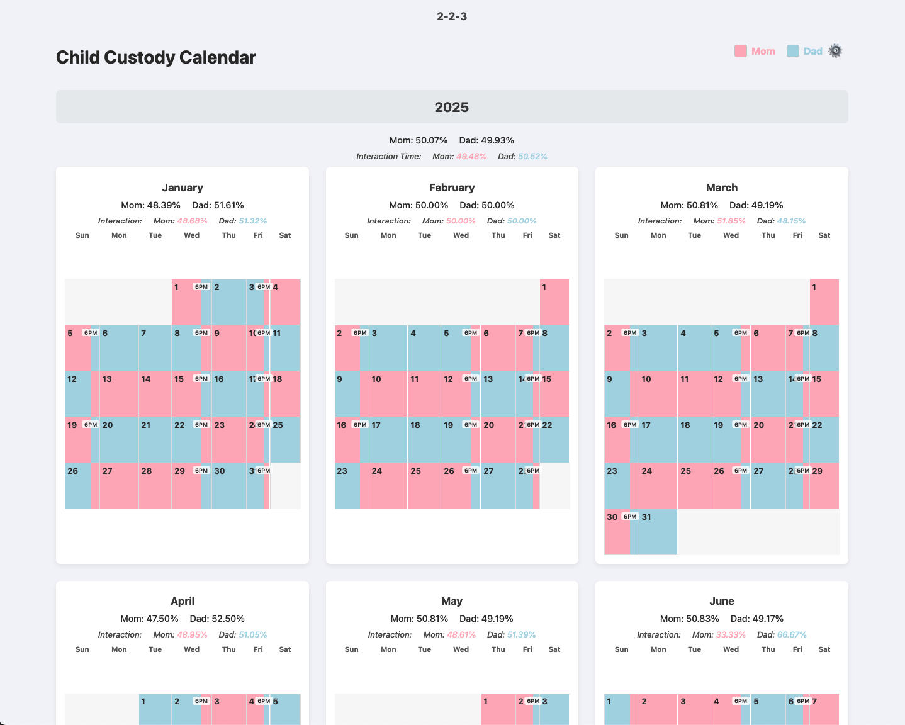
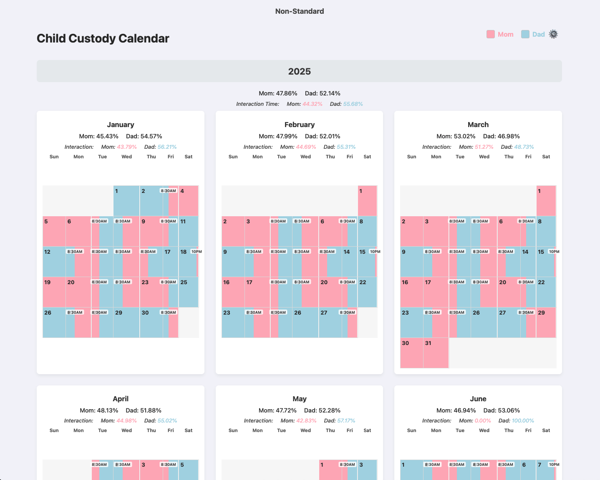

# Custody Calendar Generator

This Python application generates a detailed, interactive HTML calendar and an importable iCalendar (`.ics`) file to visualize complex child custody schedules. It is designed to handle different schedules for school and summer periods, calculate time percentages with fine-grained control, and provide detailed, auditable reports.

The primary output is a self-contained web page that can be viewed in any modern browser. The secondary output is a standard iCalendar file that can be imported into Google Calendar, Apple Calendar, Outlook, and other calendar applications.

## Features

  * **Dual Output Modes:** Generate either a visual, interactive HTML calendar or a standard `.ics` file for calendar applications.
  * **Dual Schedule System:** Define separate custody schedules (e.g., "School" and "Summer") and map them to specific weeks of the year.
  * **Dynamic Cycle Lengths:** The program automatically determines the length of a schedule's repeating cycle (e.g., a 2-week or 4-week cycle) from the schedule files.
  * **File-Based Configuration:** All schedules, date ranges, and analysis windows are configured using simple CSV and JSON files, requiring no changes to the Python code.
  * **Percentage Calculation:** Automatically calculates and displays the total custody percentage for each parent, broken down by year and by month.
  * **Interaction Time Analysis:** Define specific time windows (e.g., after school) in separate JSON files for school and summer periods to see custody percentages calculated *only* for that time.
  * **Interactive UI (HTML Mode):**
      * **Continuous View:** Toggle between a standard grid layout and a seamless, vertically stacked view of the entire year.
      * **Modal Viewer:** Click on any month in the grid view for an enlarged display.
      * **Debug View:** A "Show Window Markers" toggle displays the precise start and end of each custody window for easy data verification.
      * **Settings Panel:** A clean popup panel provides access to all view toggles and export options.
  * **Auditable Exports:**
      * **Export Page (PDF):** Use the browser's print function to create a clean, color-coded PDF of the calendar.
      * **Export Calculations (CSV):** Generate a detailed CSV report showing the month-by-month breakdown of time slots and percentage calculations for easy auditing.
      * **Export to iCalendar (.ics):** Generate a standard calendar file from the command line.
  * **Smart iCalendar Export:**
      * **Event Merging:** Automatically scans and merges consecutive custody blocks for the same parent into a single, clean event.
      * **Timezone Aware:** Auto-detects the user's local timezone and applies it to all events. Can be overridden with a command-line argument for generating calendars for different timezones.

-----

## How to Use

### 1\. Prerequisites

  * You must have **Python 3.9+** installed (for timezone support).
  * To use the iCalendar export, you must install the required libraries:
    ```sh
    pip install ics tzlocal
    ```

### 2\. File Structure

All configuration is handled through external files. The script requires at least a `schedule_map.json` and a `school_schedule.csv`.

#### **`schedule_map.json` (Required)**

This is the main control file. It defines the start and end year for the calendar and maps which weeks of the year (using standard ISO week numbers) use which schedule.

```json
{
  "start_year": 2025,
  "end_year": 2028,
  "school_weeks": [1, 2, 3, 4, 5, 6, 7, 8, 9, 10, 11, 12, 13, 14, 15, 16, 17, 18, 19, 20, 21, 22, 36, 37, 38, 39, 40, 41, 42, 43, 44, 45, 46, 47, 48, 49, 50, 51, 52],
  "summer_weeks": [23, 24, 25, 26, 27, 28, 29, 30, 31, 32, 33, 34, 35]
}
```

-----

#### **`school_schedule.csv` & `summer_schedule.csv`**

These files define the repeating custody patterns. The program automatically detects the cycle length based on the highest number in the **`Week of Cycle`** column.

The files must contain these exact columns:
`Custodian,Week of Cycle,Window number,Start Day of Window,Start Time of Window,End Day of Window,End Time of Window`

**Example `summer_schedule.csv` (a 2-week repeating cycle):**

```csv
Custodian,Week of Cycle,Window number,Start Day of Window,Start Time of Window,End Day of Window,End Time of Window
Mom,1,1,Sunday,00:00,Sunday,24:00
Dad,2,1,Sunday,00:00,Sunday,24:00
```

-----

#### **`school_interaction.json` & `summer_interaction.json` (Optional)**

These optional files define the time windows for the "Interaction Time" analysis in the HTML calendar.

**Example `school_interaction.json`:**

```json
{
  "monday": { "start": "17:00", "end": "20:00" },
  "tuesday": { "start": "17:00", "end": "20:00" }
}
```

-----

### 3\. Command-Line Usage

The script can be run in two main modes: HTML generation (default) or iCalendar export.

#### **HTML Generation (Default Mode)**

To generate the visual `custody_calendar.html` file, provide the paths to your configuration files. Only the map and school schedule are required.

```sh
python create_calendar.py schedule_map.json school_schedule.csv summer_schedule.csv
```

  * **Output:** `custody_calendar.html` (or a custom name if using `--description`). Open this file in any web browser.

#### **iCalendar (`.ics`) Export**

To generate a `.ics` file for Google Calendar, Outlook, etc., use the `--export-ical` flag. This will **only** create the `.ics` file.

```sh
python create_calendar.py schedule_map.json school_schedule.csv --export-ical "My Calendar.ics"
```

#### **Useful Options**

  * `--description "My Schedule"`: Adds a title to the HTML page, PDF header, and CSV audit file. Also sets the base name for the output HTML file (e.g., `my_schedule_custody_calendar.html`).
  * `--timezone "America/New_York"`: **(iCal Export Only)** Overrides your computer's local timezone with the one specified.
  * `--write-style-defaults`: Creates a `style.css` file with the default styles for you to customize. The script will then exit.
  * `--style-file my_styles.css`: **(HTML Mode Only)** Uses your custom CSS file instead of the embedded default styles.

## Examples

### Webpage

#### 2-2-3

`python create_calendar.py examples/schedule_map.json examples/2-2-3-schedule.csv examples/2-2-3-schedule.csv --school_interaction examples/school_interaction.json --summer_interaction examples/summer_interaction.json --description "2-2-3"`


[Live version](https://divorce-family-tools.github.io/CustodyCalendarGenerator/2-2-3_custody_calendar.html)

#### 3-4-4-3

`python create_calendar.py examples/schedule_map.json examples/non-standard-schedule.csv examples/non-standard-schedule.csv --school_interaction examples/school_interaction.json --summer_interaction examples/summer_interaction.json --description "3-4-4-3"`


[Live version](https://divorce-family-tools.github.io/CustodyCalendarGenerator/3-4-4-3_custody_calendar.html)

#### Non-Standard

Notice that, event though the custody is approximately 60/40, the time you can interact with the child is closer to 50/50.

`python create_calendar.py examples/schedule_map.json examples/non-standard-schedule.csv examples/non-standard-schedule.csv --school_interaction examples/school_interaction.json --summer_interaction examples/summer_interaction.json --description "Non-Standard"`



### PDF

#### 3-4-4-3

[3-4-4-3 PDF](examples/3-4-4-3.pdf)

### ICalendar (ICS)

An ICS file is a standard calendar file format, also known as iCalendar, that is used to share calendar information like events, to-dos, and journal entries between different calendar applications. It allows users to easily add events from emails, websites, or other sources into their calendars. Follow [these](Docs/ImportICSIntoGoogleCalendar.md) instructions to import the file into Google calendar. 

#### 3-4-4-3

[3-4-4-3 ICS](examples/3-4-4-3.ICS)

